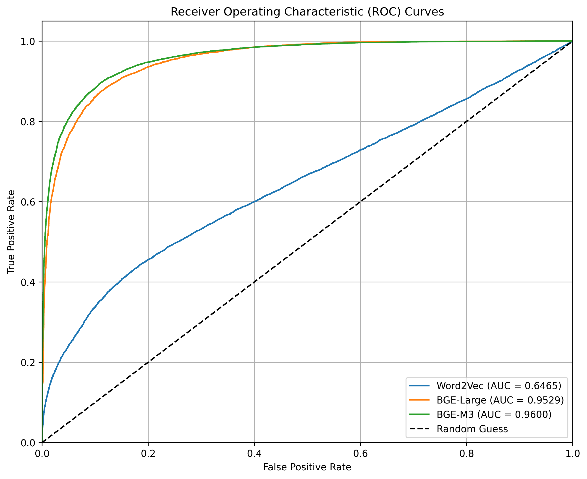
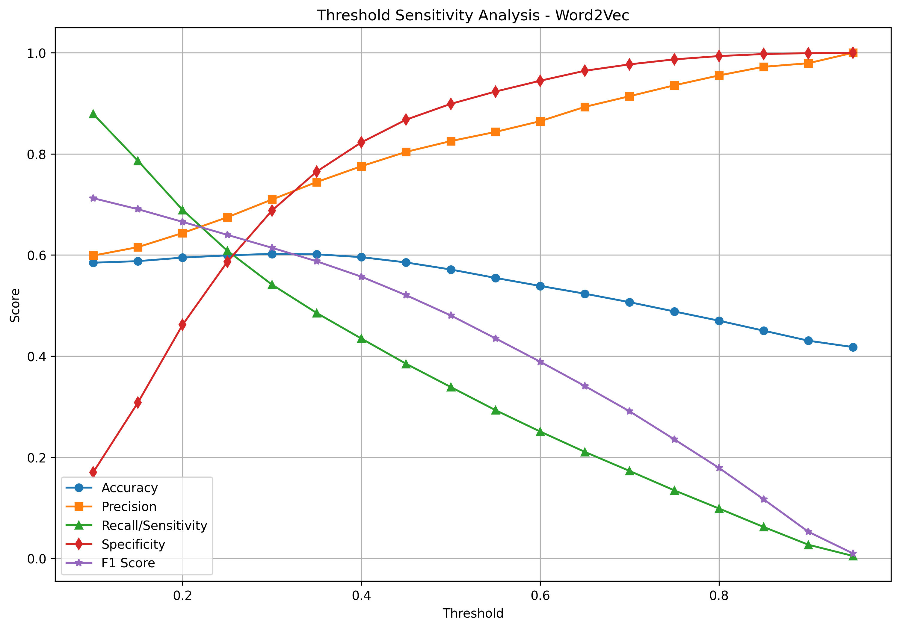
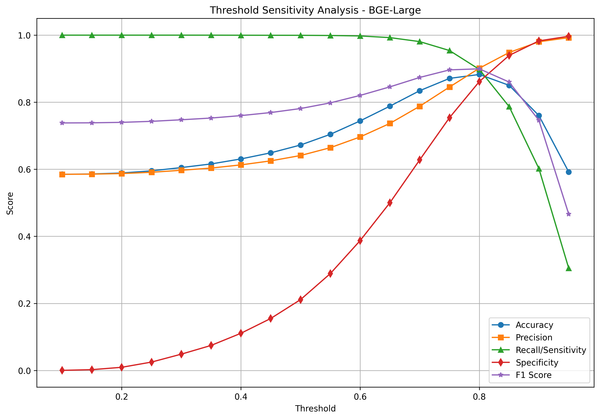
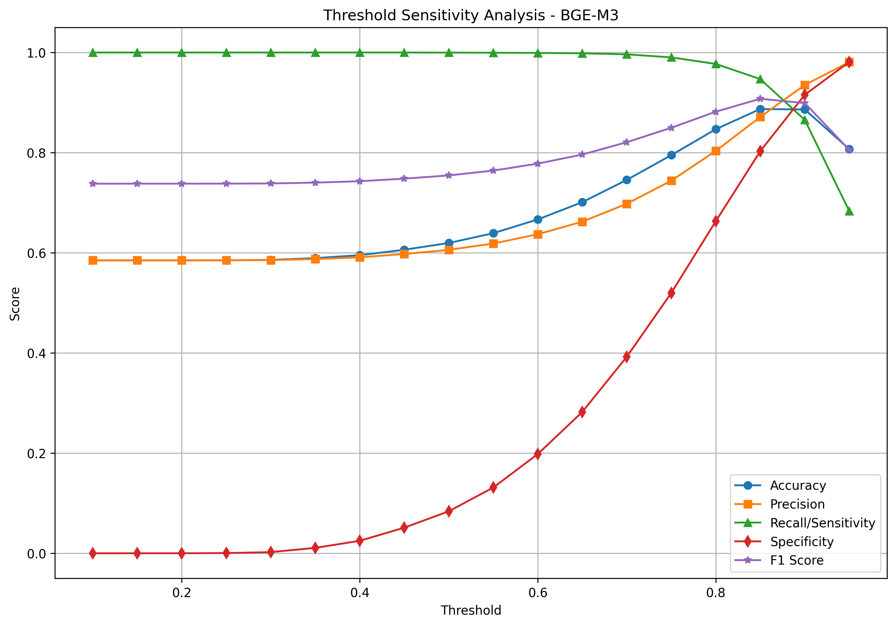

# 语义匹配模型测试与评估报告

## 1. 测试概述

本报告详细说明了语义匹配实验的测试方法、数据格式、评估指标以及实验结果分析。该评估工具专为处理语义匹配实验的结果而设计，可以评估多种模型的性能并提供可视化比较。

## 2. 测试数据格式

### 2.1 基本数据结构

测试数据采用CSV格式，包含以下字段：

```
['id', 'sentence1', 'sentence2', 'label']
```

其中：
- `id`: 数据条目的唯一标识符
- `sentence1`: 查询句子
- `sentence2`: 候选句子
- `label`: 标签，表示sentence1和sentence2是否语义相关（1表示相关，0表示不相关）

### 2.2 示例数据

```python
test_data = pd.DataFrame({
    'id': [1, 2, 3, 4, 5],
    'sentence1': ["深度学习模型需要大量训练数据", "苹果是一种水果", "自然语言处理是AI的分支", "地球是太阳系中的行星", "这本书很有趣"],
    'sentence2': ["机器学习算法依赖数据质量", "汽车需要汽油才能行驶", "计算机视觉研究图像识别", "月球是地球的卫星", "那部电影很无聊"],
    'label': [1, 0, 0, 1, 0]
})
```

## 3. 测试方法

### 3.1 语义匹配测试方法

语义匹配测试主要评估不同模型计算句子向量并进行相似度计算的能力。

#### 3.1.1 Word2Vec语义匹配测试

**测试步骤：**
1. 使用Word2Vec模型为sentence1和sentence2生成向量表示
2. 计算每对sentence1和sentence2向量之间的余弦相似度
3. 设定相似度阈值，将高于阈值的对标记为相关（1），低于阈值的对标记为不相关（0）
4. 将预测结果与ground truth标签进行比较，计算准确率、精确率、召回率和F1分数

#### 3.1.2 BGE模型语义匹配测试

**测试步骤：**
1. 使用两种BGE模型（bge-large-zh-v1.5和bge-m3）分别为sentence1和sentence2生成向量表示
2. 计算每对sentence1和sentence2向量之间的余弦相似度
3. 设定相似度阈值，将高于阈值的对标记为相关（1），低于阈值的对标记为不相关（0）
4. 将预测结果与ground truth标签进行比较，计算评估指标


### 3.2 综合评估方法

使用`Evaluator`类对不同方法的检索结果进行综合评估：

**评估指标：**
- **准确率（Accuracy）**：正确预测的样本比例
- **精确率（Precision）**：检索结果中相关句子的比例
- **召回率（Recall）**：成功检索到的相关句子占所有相关句子的比例
- **特异性（Specificity）**：实际为负的样本中被正确预测为负的比例
- **F1分数**：精确率和召回率的调和平均值
- **AUC**：曲线下面积，是模型区分正负样本能力的度量

## 4. 评估工具功能

评估工具提供以下功能：

- 加载实验结果数据并过滤有效样本
- 计算每个模型的ROC曲线和AUC值
- 找出每个模型的最佳阈值（基于Youden's J统计量）
- 计算精确率-召回率曲线和平均精确率
- 进行阈值敏感性分析，评估不同阈值对模型性能的影响
- 可视化ROC曲线、PR曲线和阈值敏感性曲线
- 将评估结果保存为CSV文件

### 4.1 使用方法

```bash
python semantic_matching_evaluator.py [--data-path DATA_PATH] [--output-dir OUTPUT_DIR]
```

参数说明：
- `--data-path`: 实验结果数据文件路径，默认为 "data/dataset1_exp_1742352405.csv"
- `--output-dir`: 输出目录，用于保存图表和结果，默认为数据文件所在目录

### 4.2 输出文件

脚本会生成以下输出文件：

1. `roc_curves.png`: 所有模型的ROC曲线图
2. `pr_curves.png`: 所有模型的精确率-召回率曲线图
3. `evaluation_results.csv`: 包含所有模型评估指标的CSV文件
4. `{model_name}_threshold_sensitivity.csv`: 每个模型的阈值敏感性分析数据
5. `{model_name}_threshold_sensitivity.png`: 每个模型的阈值敏感性分析图表

## 5. 评估指标解释

### 5.1 ROC曲线和AUC

ROC（接收者操作特征）曲线是通过绘制不同阈值下的真正例率（TPR）和假正例率（FPR）得到的。曲线下面积（AUC）是模型区分正负样本能力的度量，值越接近1表示模型性能越好。

### 5.2 最佳阈值

最佳阈值是通过最大化Youden's J统计量（J = TPR - FPR）确定的，它代表了在平衡敏感性和特异性方面的最佳决策点。

### 5.3 精确率-召回率曲线

PR曲线显示了不同阈值下精确率和召回率之间的权衡。平均精确率（AP）是PR曲线下的面积，是另一个评估模型性能的重要指标。

### 5.4 阈值敏感性分析

阈值敏感性分析展示了不同阈值值对模型性能指标的影响，包括：
- **准确率（Accuracy）**: 正确预测的样本比例
- **精确率（Precision）**: 预测为正的样本中实际为正的比例
- **召回率/敏感性（Recall/Sensitivity）**: 实际为正的样本中被正确预测为正的比例
- **特异性（Specificity）**: 实际为负的样本中被正确预测为负的比例
- **F1分数（F1 Score）**: 精确率和召回率的调和平均数

通过阈值敏感性分析，可以根据具体应用场景的需求（如更注重精确率还是召回率）选择最合适的阈值。

## 6. 实验结果

### 6.1 模型比较

在本次评估中，我们比较了三种语义匹配模型：

1. **Word2Vec**: 基于词向量的简单模型
2. **BGE-Large**: 大型预训练语言模型
3. **BGE-M3**: 多语言多模态预训练模型

评估结果显示：

- **BGE-M3** 模型表现最佳，AUC为0.9600，最佳阈值为0.8863，使用该阈值时准确率为0.8936
- **BGE-Large** 模型表现次之，AUC为0.9529，最佳阈值为0.8151，使用该阈值时准确率为0.8802
- **Word2Vec** 模型表现最差，AUC仅为0.6465，最佳阈值为0.3933，使用该阈值时准确率为0.5974

这表明预训练语言模型（BGE-Large和BGE-M3）在语义匹配任务上显著优于传统的词向量模型（Word2Vec）。特别是BGE-M3模型，其性能指标在所有方面都略优于BGE-Large模型。

### 6.2 详细性能指标

| 模型 | AUC | 最佳阈值 | 准确率 | 特异性 | 敏感性/召回率 | F1分数 | 平均精确率 |
|------|-----|----------|--------|--------|---------------|--------|------------|
| Word2Vec | 0.6465 | 0.3933 | 0.5974 | 0.8165 | 0.4419 | 0.5621 | 0.7538 |
| BGE-Large | 0.9529 | 0.8151 | 0.8802 | 0.8907 | 0.8728 | 0.8950 | 0.9636 |
| BGE-M3 | 0.9600 | 0.8863 | 0.8936 | 0.8894 | 0.8966 | 0.9079 | 0.9710 |



## 7. 阈值选择建议

我们进行了各个指标对于不同阈值的敏感性分析，结果如下：







根据阈值敏感性分析，我们可以针对不同的应用场景提供以下建议：

### 7.1 平衡场景（同时关注准确率和召回率）

使用Youden's J统计量确定的最佳阈值：
- BGE-M3: 0.8863
- BGE-Large: 0.8151
- Word2Vec: 0.3933

### 7.2 高精确率场景（更关注减少假正例）

选择较高的阈值：
- BGE-M3: 0.90-0.95
- BGE-Large: 0.85-0.90
- Word2Vec: 0.45-0.50

### 7.3 高召回率场景（更关注减少假负例）

选择较低的阈值：
- BGE-M3: 0.80-0.85
- BGE-Large: 0.75-0.80
- Word2Vec: 0.30-0.35

请参考阈值敏感性分析图表和数据，根据具体应用需求选择最合适的阈值。

## 8. 应用建议

基于评估结果，我们建议：

1. 在生产环境中优先使用BGE-M3模型进行语义匹配任务
2. 使用评估得出的最佳阈值（0.8863）作为判断两个句子是否语义相似的决策阈值
3. 如果计算资源有限，BGE-Large模型也是一个不错的选择，其性能仅略低于BGE-M3
4. 根据具体应用场景的需求，参考阈值敏感性分析结果调整阈值

## 9. 结论

通过本次实验评估，我们可以得出以下结论：

1. 预训练语言模型（特别是BGE-M3）在语义匹配任务上表现优异，显著优于传统词向量模型
2. 阈值选择对模型性能有显著影响，应根据具体应用场景选择合适的阈值
3. 在资源允许的情况下，推荐使用BGE-M3模型进行语义匹配任务
4. 阈值敏感性分析为不同应用场景提供了有价值的参考信息

